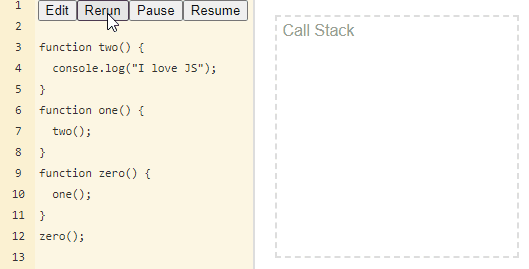
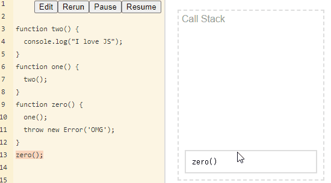
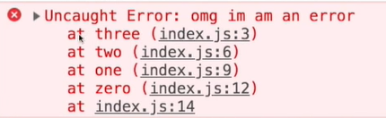

# Call Stack

Call Stack 은 자바스크립트가 함수를 실행하는 방법중 하나입니다.

자바스크립트는 함수를 실행할때 Stack위에 올리는데, stack이 뭘까요?

> Stack = 쌓아올리는 것

JS는 함수가 완료되면 Stack에서 제거하는데, 이렇게 설명하면 이해하기 어려울 것이에요.

자바스크립트를 실행하는 함수를 예시로 들어보겠습니다!

```javascript
function two() {
  console.log("I love JS");
}
function one() {
  two();
}
function zero() {
  one();
}
zero();
```

자 여기 함수3개를 선언하고 zero를 호출했죠.

이건 어떤 순서대로 실행이 될까요? 

zero -&gt; one -&gt; two 이건 모두 아실것이라고 생각합니다. 

자 그럼 이걸 한번 볼까요? 



일단 이 개념에 앞서 JS는 실행에 앞서 CallStack의 가장 첫번째에 Anaminous가 깔리게 된다는 것을 알아야 합니다. 더이상 실행할 함수가 없어진다면 Anaminous또한 Stack에서 빠지게 됩니다. 

함수안에서 다음 함수를 호출하게 된다면, 실행중에 그 함수를 실행하게 되기 때문에 call stack에 남겨진체 그 위에 호출한 새로운 함수가 쌓이게 됩니다. 

 쌓이고 쌓이고 결국 console.log\(\)라는 기능을 끝낸 함수 two는 stack에서 먼저 빠지게 되고 ,  함수 two가 끝났으니 two\(\)를 호출한 one도 stack에서 빠지게 되는 것입니다.  

근데 만약 함수 실행 중간에 에러가 발생하면 어떻게 될까요? 

```javascript
function two() {
  console.log("I love JS");
}
function one() {
  two();
}
function zero() {
  one();
  throw new Error('OMG');
}
zero();
```

이해를 돕기 위해 zero함수에서 one을 호출한 뒤 Error를 발생시켜보았습니다. 



놀랍고도 당연하게도 Error가 실행되는 시점을 보았나요? 

one\(\)이 끝나지 않았기 때문에 zero함수는 멈춰있었습니다. 

자 그리고 놀랍게도 개발자 도구를 눌러보면 



지금까지 거쳐간 함수들이 모두 나와있는 것을 볼 수 있답니다.

아, 참고로 자바스크립트에는 스택에 올릴 수 있는 함수의 제한이 있습니다. 

이것을 바로 Maximum CallStack이라고 하는 것이랍니다.

예를들어 두개의 함수가 다음과 같이 서로를 호출한다면 어떻게 될까요? 

```javascript
function man() {
  women();
}
function women() {
  man();
}
man();
```

`RangeError: Maximum call stack size exceeded`

이런 에러가 출력될 것입니다. 

